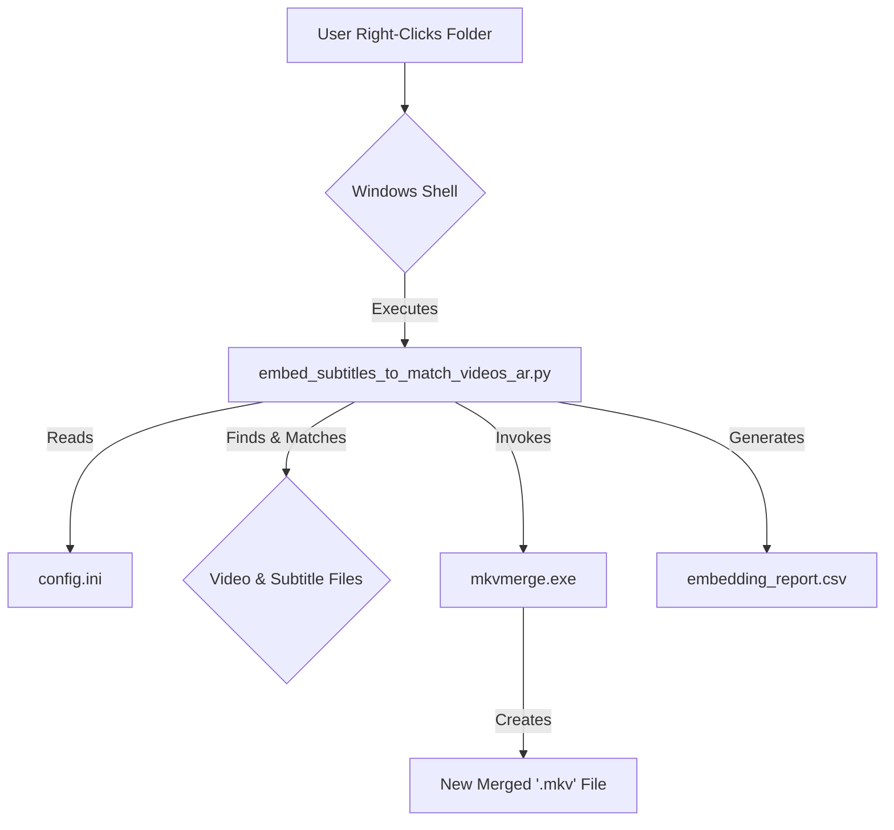
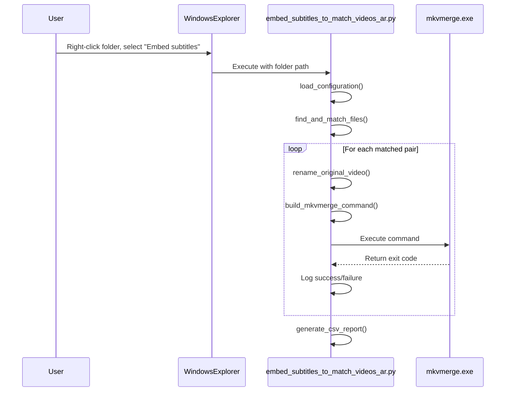

# Architecture Document: Subtitle Renamer Tool [AR] - Subtitle Embedding Feature

* **Project Name**: Subtitle Renamer Tool [AR]
* **Feature**: Subtitle Embedding via `mkvmerge`


## 1. High-Level Architecture

### 1.1. Technical Summary

The architecture for the subtitle embedding feature is designed as a standalone Python script, `embed_subtitles_to_match_videos_ar.py`. This script will function as a command-line tool that orchestrates file system operations and calls to the external `mkvmerge.exe` utility. It is designed to be modular, reusing the proven file matching logic from the existing `rename_subtitles_to_match_videos_ar.py` script to ensure consistency and reliability. The architecture emphasizes clear separation of concerns: configuration, file processing, `mkvmerge` command generation, and reporting.

### 1.2. High-Level Overview \& Project Diagram

The system operates in a simple, linear flow initiated by the user via a Windows context menu command.

1. **User Action**: The user right-clicks a folder and selects "Embed subtitles".
2. **Script Execution**: Windows executes `embed_subtitles_to_match_videos_ar.py`, passing the folder path as an argument.
3. **Core Logic**: The script scans the folder, matches `.mkv` files with subtitle files, renames the original videos for backup, and then invokes `mkvmerge.exe` for each pair to create the new, merged video.
4. **Output**: A new `.mkv` file with the original name is created, and an optional CSV report is generated.



### 1.3. Architectural and Design Patterns

* **Modular Design**: The script will be organized into distinct functions, each with a single responsibility (e.g., `load_config`, `find_matching_files`, `build_mkvmerge_command`, `run_command`, `generate_report`).
* **Facade Pattern**: The main script will act as a facade, providing a simple interface to the more complex underlying logic of file matching and command execution.
* **Strategy Pattern**: The language detection logic (`FR4`) will implement a strategy pattern: first, it will try to extract the language from the filename; if that fails, it will fall back to the strategy of using the language from the config file.


## 2. Tech Stack

| Category | Technology | Version/Path | Purpose \& Rationale |
| :-- | :-- | :-- | :-- |
| **Language** | Python | 3.8+ | Primary development language. Chosen for its strong file system libraries, ease of scripting, and cross-platform nature. |
| **External Tool** | MKVToolNix | Latest | The suite that provides `mkvmerge.exe`. Required for the core functionality of muxing Matroska files. |
| **Configuration** | INI File | `config.ini` | A single, unified file for both scripts, using sections to separate settings. This provides a simple, centralized, and human-readable format for all user configuration. |
| **OS Integration** | Windows Registry | `.reg` file | To provide the required "Embed subtitles" context menu option in Windows File Explorer. |

## 3. Component Breakdown

* **`main`**: The entry point of the script. Parses command-line arguments, orchestrates calls to other components, and handles top-level error trapping.
* **`config_loader`**: Responsible for reading and validating settings from the single, unified `config.ini`. It will parse settings from specific sections (`[General]`, `[FileFormats]`, `[Embedding]`) and provide default values if the file or a setting is missing.
* **`file_matcher`**: Reused/adapted from `rename_subtitles_to_match_videos_ar.py`. It contains the logic to scan a directory and accurately match video and subtitle files.
* **`command_builder`**: Constructs the precise `mkvmerge` command-line string for each matched pair.
* **`process_runner`**: Executes the generated `mkvmerge` command using Python's `subprocess` module.
* **`file_manager`**: Handles the file system operations as defined in the PRD (renaming the original video file).
* **`report_generator`**: Implements the logic for writing the `embedding_report.csv` file if enabled.


## 4. Core Workflow (Sequence Diagram)




## 5. Source Tree

The corrected project directory will be as follows :[^1]

```
C:/rename_subtitles_to_match_videos_ar/
├── embed_subtitles_to_match_videos_ar.py
├── add_embed_subtitle_menu.reg
├── remove_embed_subtitle_menu.reg
├── mkvmerge.exe
├── rename_subtitles_to_match_videos_ar.py
├── config.ini
├── add_subtitle_rename_menu.reg
├── remove_subtitle_rename_menu.reg
├── ARAB_STREAMS_LOGO.ico
└── CONFIGURATION_README.md
```


## 6. Infrastructure and Deployment

* **Infrastructure**: The tool runs locally on a user's Windows machine.
* **Deployment**: The user must place the project folder at `C:\rename_subtitles_to_match_videos_ar\`, run the `.reg` file to install the context menu, and ensure `mkvmerge.exe` is either in the folder or its path is set in `config.ini`.
